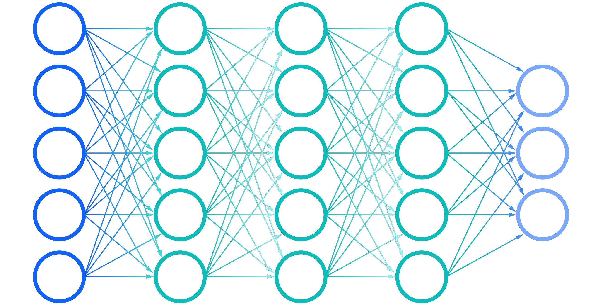

## Past

  I’ve always been interested in computers, in part due to my enjoyment of video games, even as early as elementary school. I even played around a bit in Scratch during middle school. But I never began to explore development and real code until high school, where I learned Python as my first language. Ever since, I’ve known it’s what I want to do as a career and have been pursuing more knowledge and experience in the field of software engineering, as well as trying to expand my repertoire as a programmer overall.

## Present

  Currently, I hope to be able to continue improving my abilities in common languages that I have experience in, such as Python, Java, C++, etc. as well as learn how to write in new languages and utilize new frameworks. A large part of improving would be learning how to create larger programs and projects that can actually be deployed practically, such as on a website. Proficiency in web development is a very useful skill to have in many scenarios. I also aim towards being able to overall expand my portfolio and create new projects that can showcase my abilities. 

## Future

  In the future, I hope to be able to work in fields such as machine learning or game development, though I presently don’t have that much experience in either. Machine learning, especially with the advent of publicly available and popular AI like ChatGPT and similar chatbots, is a very interesting subject that holds a lot of undiscovered potential. It is certainly a topic that I will be looking into in the future, whether professionally or just as an interest. As for game development, it is more of a personal interest, due to my hobby of playing video games, though I would potentially be interested in pursuing it as a career as well.

