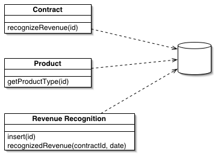
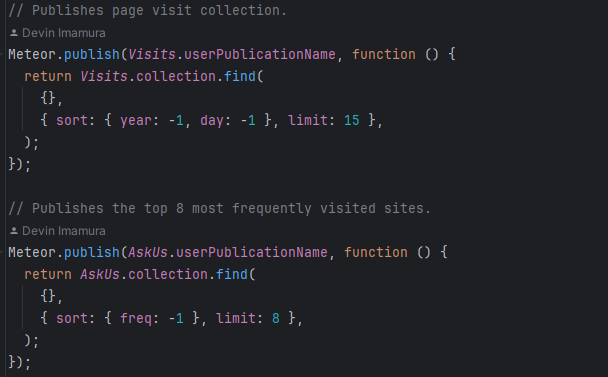
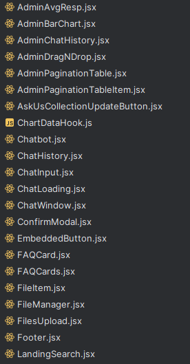

In the process of programming, it is quite likely that you have seen a problem that you have come across before, at least at some base level. You may have even used similar solutions to those from your past. In doing so, you have participated, at least at a fundamental level, in the process of using “design patterns.” But what are design patterns, and why should(/shouldn’t) you use them?

## What are design patterns?

Design patterns are, as you may have surmised from the introductory section or name, a sort of template or structure. They provide a generally agreed upon, stock standard solution to some type of problem, without delving too much into the specific implementation. For example, one common design pattern in Javascript is the module pattern; when you split your code into multiple, separate modules. This allows you to both have a more organized codebase with distinct modules that do certain things, and also reuse said modules elsewhere if needed. Such is only one example of the many different design patterns out there, all of which have similarly helpful and unique applications.

## Why should I use design patterns?

By using design patterns, you receive many benefits: better readability, scalability, and time efficiency to name a few. As in the example above, it can help to improve the readability of your code, both for outsiders and potentially yourself in the future. Design patterns are also tried and tested, and are proven to work. This means that you should run into less problems than you would have otherwise by attempting to make your own solution without a pattern, and might also spend less time trying to figure out how to scale and expand upon a certain element.

Take for instance, my most recent [project](https://github.com/Regex-ICS314/AskUs). In it, my team utilized various design patterns, such as:

The prototype pattern, as is the nature of coding in the prototype-based language of Javascript. 
We also used meteor to integrate patterns like observer, MVC, and front controller.		

                                            
The code above is a snippet of our publishing function file, which makes data from the server available to clients in limited and specified amounts. This data is used to reactively render data on the client side as needed. The second function is used to render the following:

                                            
These cards are dynamically updated based upon which questions are most commonly asked, which depends upon user input. The client-side code elements are the “observers,” waiting for information supplied by the server and database, whose structure with the client is in an MVC format.

Our code also implements other patterns, such as modules, singletons, static imports, etc. Without modules (explained above) our code would be a giant and hard-to-navigate file.

                                            
Our code additionally uses singletons, a sort of global variable using a class that can only have a single, global instance. In our code, this is used for creating the collections of data for our database, each of which have a singleton instance for ease of use and access.

## The Downsides of Design Patterns

Though many claim design patterns are important to the software engineering process, which they are, they are not without downsides. Using and abusing design patterns too much can lead to overcomplicated and arbitrary code. Also, similarly to how many of the design patterns above can be implemented without intentionally adding them, there are also negative design patterns which can be detrimental to the project if added unintentionally as a result of oversight or negligence.

## Conclusion

To conclude, design patterns are a very useful tool for software engineers, which can not only increase the speed and efficiency of application creation, but also improve quality as well. You shouldn’t purposefully implement design patterns for no particular reason, but if you have a particular problem to solve, they can assist greatly. Even just being aware of them, and keeping them in mind as you write to potentially add is a boon to your codebase. 
