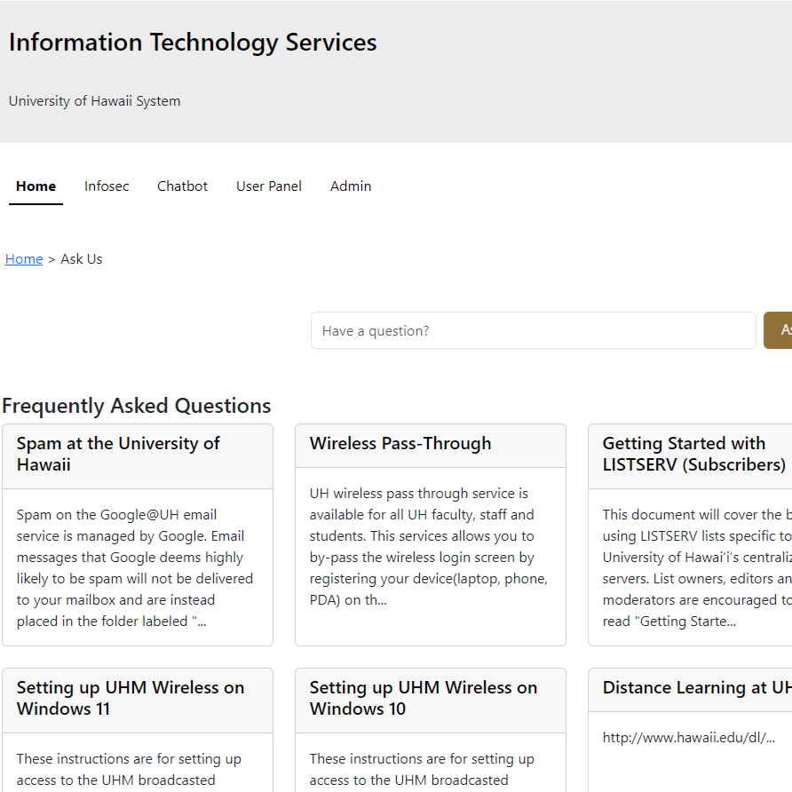

  

  The Ask Us Chabot is a web application that I created as a part of the 2023 Hawaii Annual Code Challenge (HACC). Its purpose is to help users more easily find answers to their questions in a conversational tone, taking the burden off of the UH ITS helpline, who would otherwise have to take calls and redirect the caller to some help article. This chatbot cuts out the middleman and is able to quickly answer any questions that users may have, as well as redirecting them to relevant pages. It also has additional features for admin users, including a variety of statistics regarding usage and the database.

  The Ask Us Chatbot was created using Meteor, as well as React-Bootstrap. The chatbot itself uses OpenAI to power its responses. I mostly worked on everything besides the chatbot, creating both the frontend and backend for the landing page and most of the admin page. I also fixed a large quantity of bugs and errors throughout the code.

  This project gave me a lot of experience with using Javascript and creating web applications. Since I built a lot of the components, dealing with both the frontend React portion as well as some of the MongoDB databases, it has really taught me how to create a usable website.

The site is currently deployed [here](https://askuh.info/).

You can find an overview video of the site here: <a href="https://youtu.be/1XBOLA5W7lg?si=qEjOiR1EsJ6_BWo8">https://youtu.be/1XBOLA5W7lg?si=qEjOiR1EsJ6_BWo8</a>
 
You can find the information on project itself [here](https://regex-ics314.github.io/).
