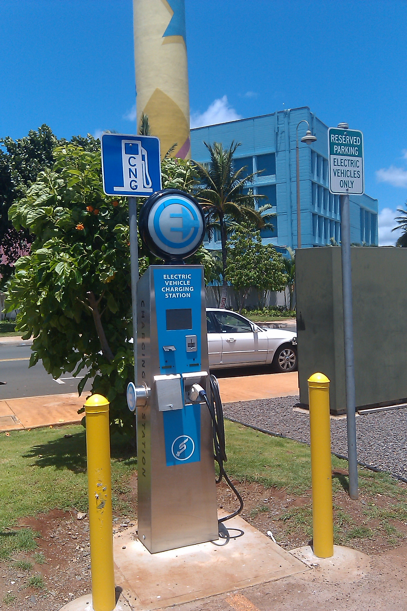

  

  SHC is a web application that I helped develop as a part of my high school coding club. It was developed over a few weeks for the 2019 Hawaii Annual Code Challenge (HACC), and was able to take first in the high school division. It aims to solve one of the problems provided by the government and various companies, out of which we chose to create a website that tracked the status of various electric vehicle charging stations. It visualized data pulled from CSVs to show which chargers were having issues, the severity of the issues, as well as which chargers were going unused. 

  SHC was created through Django, a Python web framework. During this project, our team split into backend and frontend groups. I worked extensively on the backend python functionalities included in the project, which helped me further my understanding of the language. HTML/CSS, Django, and SQL functionalities were mainly handled by other members, though we did work on our vision for the final product as a collective.

  Specifically, as a part of the backend group, I worked on the functions involved with the computations/inner workings of the site, such as pulling the data from CSVs and transforming it into outputs to give to the frontend group. Having learned Python around this time, it gave me valuable experience in the language itself and allowed me to cement my skills. It also taught me to work with CSVs and other files that you might recieve as input as opposed to a clean input array or something of the sort.

You can find the information on project itself here: <a href="https://devpost.com/software/shc">https://devpost.com/software/shc</a>
